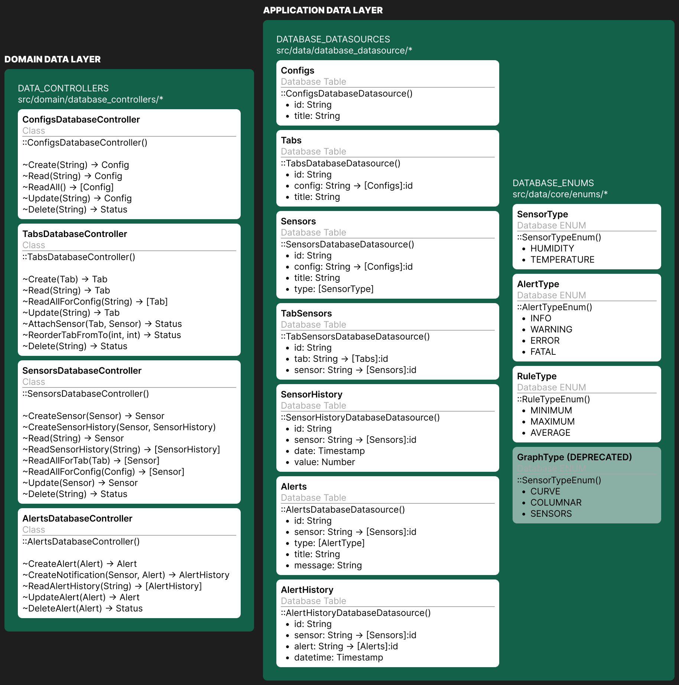

# Sensor Monitoring

## Description

Service for monitoring sensors. Student project.

## Docker Container

### Set up working space inside VS Code
- Build this [image](Dockerfile) before launching the container (once per working machine).

- Run developer container inside VS Code (Ctrl+Shift+P > Dev Containers: Rebuild and Reopen in Container).

### Run flutter application

Run following command to start web session inside container to port to localhost machine.

```sh
flutter run -d web-server --web-hostname 0.0.0.0 --web-port 3000
```

## Application database integration


